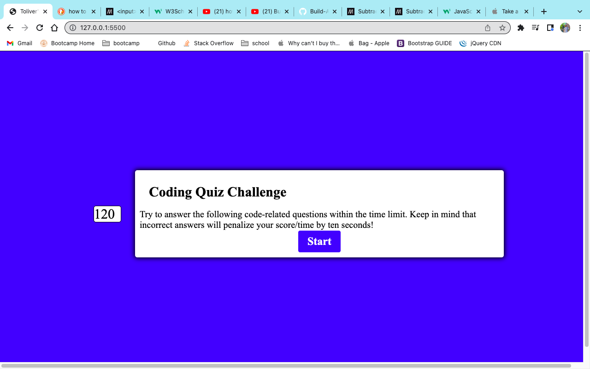
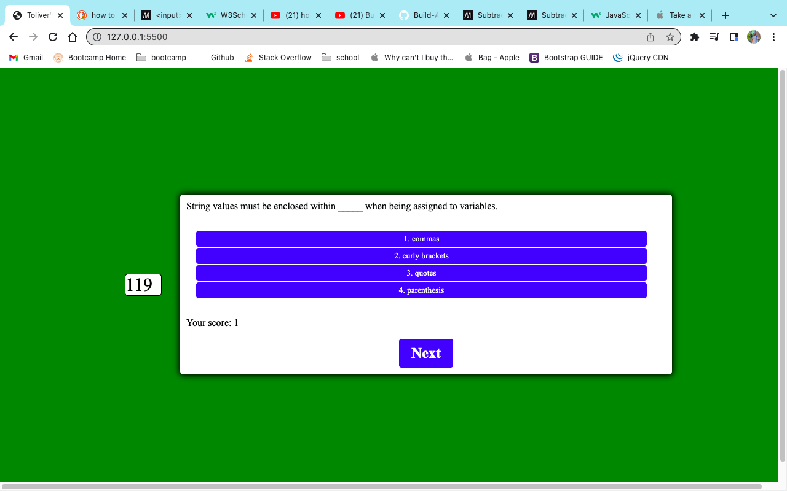

# 04 Web Api Challenge -- Coding Quiz

## Description

**- What was your motivation?**

I was motivated to build this project in order to practice and utilize my new skills in the 04-Web-Api unit. I wanted to learn more about how to use a basic API in Javascript, and oh boy, did I. As always, I wanted to add something extra so I found out how to make the colors on the webpage change when you got something correct or incorrect. I'm glad I tried to implement it, but honestly it got a little too complicated for me at the end.

**- Why did you build this project?**

(I still think this question is just repeating the previous one, right?) I built this project so I could put everything I've learned into practice and create a functional, responsive quiz to showcase on my Github profile.

**- What problem does it solve?**

Many people (like myself) need to practice using what they know in order to retain the information, so a user could use this application to study their fundamental Javascript knowledge whenever they need a refresher.

**- What did you learn?**

I learned a lot during this challenge, so I will bullet examples below for the sake of brevity.

- Actually use functions one-after-another on a webpage (from scratch)
- Literally the entirety of Javascript Web API fundamentals. I'd never used them in practice before from scratch and WOW. At first, it feels really easy and then a couple hours later, you're sitting in front of a wall of code that's 200 lines long.
- I learned how absolutely crucial it is to comment your code when you have so many different things going on. That was the big pitfall of my project. I got ahead of myself and ended up tangling myself up completely.

## Installation

N/A

## Usage

To find this website, please find my repository named "toliver-coding-quiz" at https://github.com/tolivercrisp/toliver-coding-quiz.

## License

The last section of a high-quality README file is the license. This lets other developers know what they can and cannot do with your project. If you need help choosing a license, refer to [https://choosealicense.com/](https://choosealicense.com/).

# Screenshot

Thank you!

